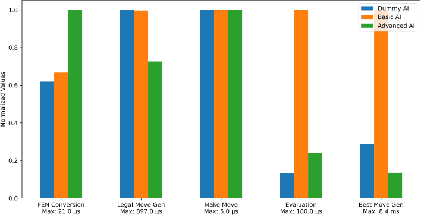
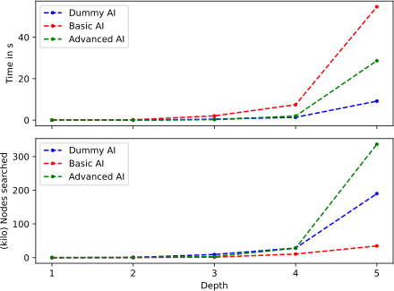

# 
Milestone III - Advanced AI

## 
Group C - The Plebs

A chess AI written in Python.

## Summary

A quick overview of what happend in this milestone:

- Restructured the chess backend
    - Clean ups like name conventions
    - Using `list` of `int`
    - Minor bug fixes
- Improve AI
    - Speed up evaluation
    - Improve move ordering
    - Minor bug fixes
- Restructure the debug log
- Add king of the hill conditions
- Better and more tests and benchmarks

## Changes to the Chess Backend

The backend was in dire need of a restructure.
It was created in a rush to meet the deadline
of the first milestone and was therefore not written
with maintainability in mind.
The following things were changed:

- Use `snake_casing` consistently
- Replace `class CastlingRights` with a `list`
- Add guard clauses to reduce indentation and increase readability
- Turn `debug_info` from `dict` to a `class` (in `log.py`)
- Use `list` of `int` for board instead of `str`

For a more detailed description see the
[commit history in #37](https://github.com/PraxTube/chess-ai/pull/37/commits).

The way I restructured the backend was actually
very teaching. At first I wanted to simply write
the whole backend from scratch with the new changes.
However, I quickly realized that this wouldn't really
work. So instead I opted to apply the changes in layers,
where after each change the whole backend should still
be working.

This was extremely effective. It not only allowed me to
assert that the changes I made didn't introduce new bugs,
but also made commiting very clean, and also made sure
that I would be able to track down bugs if they did occur.
So in future projects I will use the same way to restructure
bigger files.

## AI

There were quite a lot of changes regarding the AI.
I mainly tried to implement transposition tables,
however that went horribly wrong.
I wrote a seperate article in which I documented what went wrong,
[see here](./transposition-tables.md).
Apart from that _minor_ set back, I implemented the following changes:

- Check if given node is terminal node (checkmate/stalemate)
  as opposed to only checking `depth == 0`
- Add a proper king of the hill victory condition (and properly test it)
- Improve time management to be more dynamic (allocate time depending
  on the current stage: early, mid, late)
- Refactor move ordering to be much more performant

The AI is playing both faster and stronger now.

## Benchmarks

The results of the backend restructure and the AI refactor were
pretty successful, as can be seen in the plots below.
In figure 1 we can see that the advanced AI is overall much faster then
the previous version. Do note that the dummy version implements minimax
with an evaluation function that simply calculates the material difference.
So the evaluation of the dummy is hard to outperform.

The tests were run on a PC with the following specs

- CPU: Intel i5-4590, Threads: 4, Cores: 4, 3.7GHz

- RAM: 24GB DDR3

- OS: Zorin 16.2 (Ubuntu based)

    
     
    Figure 1: Benchmarks of the different categories across the AI versions.

In figure 2 we can see that the advanced AI is much faster then the basic AI.
We can also observe that we search a lot more nodes then in the dummy AI case.
This shouldn't be, because the dummy AI implements minimax (and not alpha-beta).
I fixed a bug during this milestone which is most likely the cause for this.
In this bug the amount of boards to search was decreased, so the dummy AI
is actually much slower.
In other words, the actual speed increase from the minimax to the current AI
is much more significant. This also explains the rather weird behaviour we
saw in the last milestone (where the cutoff effect didn't seem that strong).

    
     
    Figure 2: Benchmarks of different AI versions in respect to search depth.
     
    Note that the number of nodes searched is in thousands (kilo).

## Lessons learned

A collection of lessons that I learned during this milestone

1. Benchmarks are extremely useful, not only to see improvements
   over different versions of your code, but also to compare
   incremental changes to the code. I realized this when I tried
   to refactor the evaluation function to use `numpy`. When I had
   many small `np.ndarray` it was actually slower then the pure python
   `list` implementation. This is because we always
   have overhead when calling numpy, so reducing the amount of times
   we call `numpy` draws out the full potential of `numpy`,
   i.e. use as big as arrays as possible.
   That I did, and the evaluation function went from `200μs` to `50μs`.
1. On the note of benchmarks, I also observed that background tasks
   can significantly influence the result of benchmarks. One should
   try to run them in the same-ish environment as possible
   (or use a server for that if possible).
1. Sticking to atomic commits when restructuring something big is vital.
   It allows to keep a running system which can be checked to make sure
   no bugs went into the restructure.
1. Unit tests are really handy when restructuring.
   After every commit I could just run the tests and see if there
   were any issues (of course one shouldn't overly rely on them).
1. It's important to know if something will be worthwile before commiting
   to it if it will take a long time to complete. I learned this with
   the attempt at implementing transposition tables. If I would have known
   that the potential performance increase was about `~10%`, I would have
   probably not even tried it in the first place, given how much effort
   went into it.
1. Debugging hash tables is actually not as straightfoward as it initially
   seemed. If you can't use a debugger properly then it's
   a real mess. Something I want to learn in the future.

## Future Improvements

I found that I cannot improve the engine much further then
what I have right now.
While it would be possible to restructure the whole backend to use
something like `0x88` or bitboards, that would require an extreme amount
time and effort. Also, it's doubtful that those changes would
have a huge effect in the end, given that the main bottleneck
will always be python.

One possible refactor is to implement the evaluation
in pure C. Though I highly doubt that this would increase
the speed by more then `30%`, and given that I just learned
that commiting to things you aren't even sure will pay out
in the end is a bad thing, I think I will try to avoid it.

Apart from that, there is not much that can be
improved performance-wise. That is simply because
the legal move generation is just so insanely slow.
For mid game boards it can take a whole millisecond
and the only way to increase the performance
would be to completely restructure the backend in C.
That is obviously not going to happen.
So instead I will focus my attention on making the
AI stronger by implementing better and more AI
techniques.

## Final remarks

This milestone was pretty successful overall.
While some things didn't work out, a lot of others did.
I was also able to learn from all of it.
Though I hope the workload will be more balanced
in the next milestone,
[see commit history](https://github.com/PraxTube/chess-ai/commits/master).
