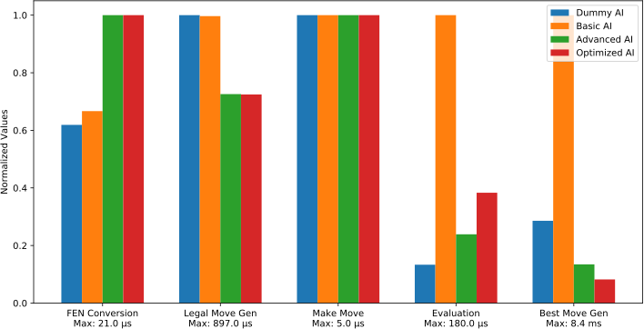
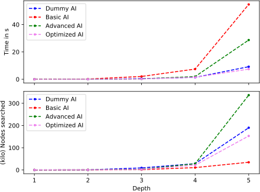

# 
Milestone IV - Optimized AI

## 
Group C - The Plebs

A chess AI written in Python.

## Summary

In this milestone we primairly focused on the AI and to improve
the AI's strength and speed.

## AI

We implemented the following AI features:

- PVS/negamax
- Nullsearch
- MCTS

### Evaluation

We improved the evaluation function to include the following features

- Check if it's late game, if so, use different PeSTO table
- Evaluate King danger
- Punish bad pawn structure (isolated, backward, not right aligned)
- Pigs on the 7th rank (rooks on 7th rank)

While the above additions make the evaluation slower overall, we think
that it was a good trade-off for a stronger AI.
Fine tuning a few hyperparameters (through research and
trial and error) also helped to increase the strength without any trade-offs.
We also tried to implement mobility evaluation, however in our case
it was just way too slow so we removed it. Also checking if two bishops
are present was too slow.

The main reason we were able to implement some features and some not,
was mainly a question about can we vectorize it properly with numpy.
Features that required calcuations that could be cleverly put into
one single numpy call were the best, because with numpy it's essentially
constant time to call it. On the other, features that only required
checks were you had to loop through the board were simply to slow
compared to the rest.

### PVS/Negamax

PVS (Principal Variation Search) combined with negamax is an efficient algorithm for searching the game tree and evaluating the best moves. The primary challenge we encountered was understanding the intricacies of the algorithm. Ensuring the correctness and efficiency of our PVS/negamax implementation demanded careful debugging and testing. However, with thorough research and trail and error, we were able to overcome these challenges successfully (although it seems like there might still be some issues, it works fairly decent in most cases).
We also had some problems when implementing this feature in our code base simply because the AI framework was pretty bad.
While we did refactor the chess backend in the previous milestone, we didn't do the same for the AI (though to be fair, the AI is much less complex). So we also restructured the AI framework (partially) with the features we implemented in this milestone.

### Nullsearch

Implementing nullsearch involved modifying our search algorithm to skip certain moves and evaluate the position based on the assumption of no move being made. The main challenge here was determining when and where to apply null moves and ensuring that the search results remained accurate. Tuning the nullmove heuristic and fine-tuning the implementation took some time, but we managed to integrate nullsearch into our AI effectively.
This was probably the easiest feature we implemented in this milestone. It was a decent boost in the performance for fairly little work, so overall probably the best ROI (Return of Investment) in this milestone.

### MCTS

The challenges we faced with the MCTS implementation were mainly related to the design and structure of the search tree. Coding up the algorithm was actually not too hard, especially because some members of the team already covered MCTS both in theary and in practice in a separate course. This actually allowed us to implement it fairly fast without any major hiccups. The main challange here was to balance exploration and exploitation effectively to improve the AI's decision-making. The complexity of MCTS required us to carefully manage the tree's expansion, simulation, and backpropagation phases. Additionally, tuning the exploration parameter and the number of simulations proved to be crucial for achieving good performance. Though given that we were already quite familiar with MCTS we managed to overcome this challange and integrate MCTS successfully into our AI.

## Benchmarks

TODO CONTENT

The tests were run on a PC with the following specs

- CPU: Intel i5-4590, Threads: 4, Cores: 4, 3.7GHz

- RAM: 24GB DDR3

- OS: Zorin 16.2 (Ubuntu based)

    
     
    Figure 1: Benchmarks of the different categories across the AI versions.

    
     
    Figure 2: Benchmarks of different AI versions in respect to search depth.
     
    Note that the number of nodes searched is in thousands (kilo).

## Lessons learned

## Final remarks

